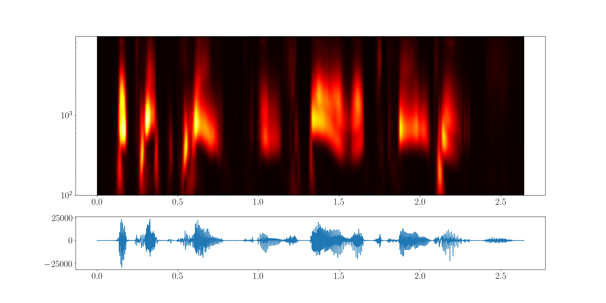

# Small scripts to compute Continuous Wavelet Transform



## Requirements
You need numpy, scipy, matplotlib, numpy-stl, and PyWavelets. You can install them like this:

```
sudo pip3 install scipy numpy matplotlib numpy-stl PyWavelets
```

The scripts are designed to be used on linux system with python 3, but you can change that with minimal effort if needed (or open an issue).

## Usage

The script `make_cwt.py` loads the signal and computes the transform. It can be used like this:
```
python3 make_cwt.py paras.py
```
You need to edit `paras.py` to give the path to the initial signal and set various options. You can directly use the script without argument (`python3 make_cwt.py`), in which case it will always use the file `paras.py` by default. The script can save the results in a pickle of numpy arrays for later use, as well as an .stl file. It can also produce a heatmap plot. Read the `paras.py` for more information. This plot can also be later generated using the other script:
```
python3 plot_cwt.py paras.py
```
Once again, you can omit the argument and the script will look for `paras.py`. 
